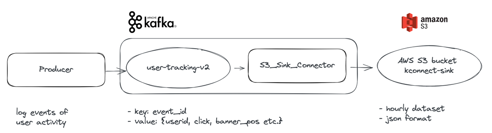
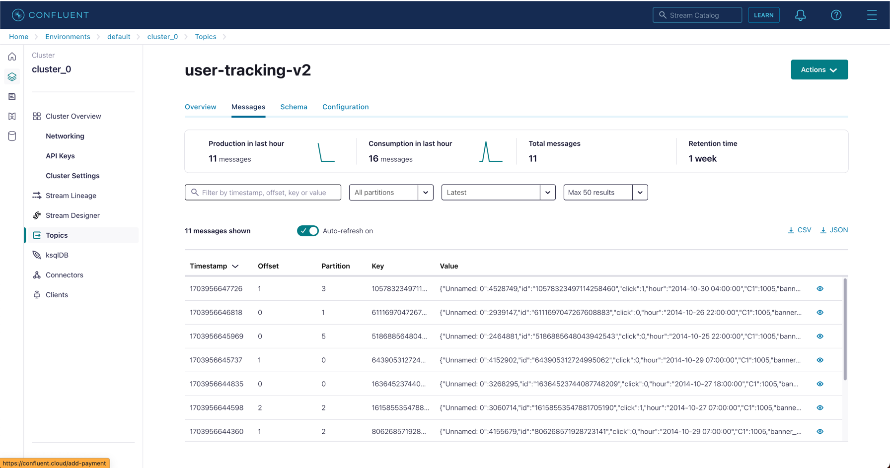
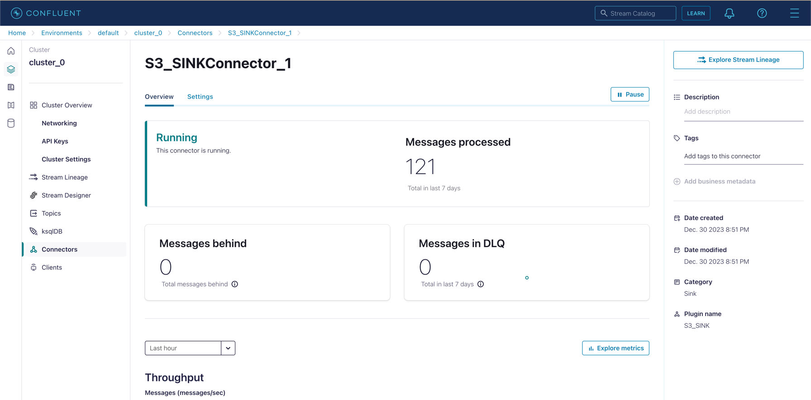
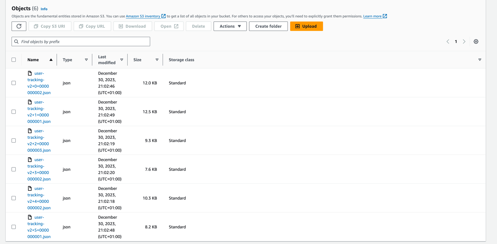

# user-tracking

## Sem4. Kafka
В этом занятии мы познакомимся с [Apache Kafka](https://kafka.apache.org/), инструментом для потоковой передачи данных. 
Для демонстрации мы воспользуемся сервисом [Confluent Cloud](https://www.confluent.io/confluent-cloud/) 
и построим пайплайн для записи событий кликов пользователей из датасета [Avazu](https://www.kaggle.com/c/avazu-ctr-prediction).

План занятия:
- Поднимем Kafka кластер и создадим топик для коммита сообщения в [Confluent Cloud](https://www.confluent.io/confluent-cloud/) 
- Напишем Producer для записи сообщений в топик с помощью API [confluent_kafka_python](https://github.com/confluentinc/confluent-kafka-python)
- Поднимем [S3 sink connector](https://docs.confluent.io/kafka-connectors/s3-sink/current/overview.html) для аггрегации сообщений за час и передачи данных из топика в бакет S3 в виде датасета в формате json

Финальный пайплайн будет выглядеть следующим образом



### Основные команды
```bash
# login and checkout the working environment
confluent login --save
confluent environment list

# connect to kafka cluster inside environment
confluent kafka cluster list
confluent kafka cluster use <clusterid>

# check list of topics
confluent kafka topic list

# check list of KConect connectors and create connector
confluent connect cluster list
confluent connect cluster create --config-file config/s3_sink_connector_config.json
```


### Результаты

Топик для записи активностей пользователей `user-tracking-v2` с записанными в него сообщениями.
Сообщения распределенные по 6 партициям


S3 sink коннектор, который читает сообщения с топика `user-tracking-v2`, 
аггрегирует данные за час и записывает их в S3 бакет `kconnect-sink`



Финальный результат: датасет активностей пользователей за час, записанный коннектором в json формате и распределенный по 6 партициям
